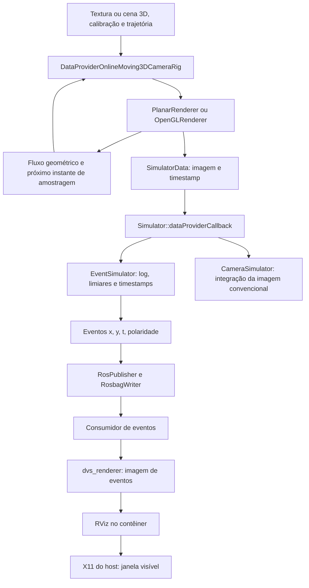
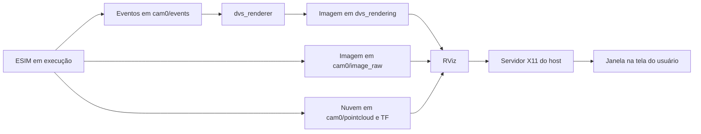

# ESIM: geração de eventos, execução gráfica em Docker e visualização temporal no RViz

Relatório Técnico — 15 de setembro de 2026.**

Este capítulo reúne o princípio de funcionamento de uma câmera de eventos e sua implementação no ESIM, acompanhando as entradas, as transformações, a gravação e a visualização. A versão atual do ambiente, descrita em `COMO_RODAR_ESIM.md`, permite simulação 3D com RViz e reprodução de arquivos bag em loop, além do exemplo planar sem janelas. A interface gráfica usa o servidor X11 da sessão Linux do host, com acesso por Xhost e aceleração NVIDIA na configuração validada.

A análise do núcleo foi conferida no código do ESIM, commit `4cf0b8952e9f58f674c3098f1b027a4b6db53427`. A montagem Docker, os scripts personalizados e os resultados das execuções Linux são informações dos dois documentos fornecidos; não foram novamente executados ou validados nesta análise. Os scripts e as configurações gráficas personalizados não estão no workspace examinado. O procedimento de visualização por janelas temporais apresentado adiante continua sendo uma metodologia proposta para análise quantitativa, distinta da visualização atual pelo RViz.

## 1. Objetivo e princípio de medição

O objetivo do experimento é transformar a aparência de uma cena e o movimento de uma câmera virtual em uma sequência de eventos, e então organizar esses eventos em imagens que permitam observar sua evolução temporal. Há duas transformações sucessivas: a simulação produz eventos a partir de intensidades variáveis no tempo; a visualização agrega os eventos para exibi-los em uma tela.

Uma câmera convencional entrega matrizes de intensidade em instantes de captura. Uma câmera de eventos, por sua vez, responde a mudanças locais de brilho: cada pixel pode produzir uma medição em seu próprio instante. Representamos essa medição por

> **eₖ = (xₖ, yₖ, tₖ, pₖ)**, com **pₖ = −1 ou +1**.

O índice **k** identifica um evento da sequência; **xₖ** e **yₖ** são suas coordenadas, **tₖ** é seu instante e **pₖ** é sua polaridade.

As coordenadas identificam o pixel, o timestamp informa quando ocorreu a mudança e a polaridade distingue aumento de redução de brilho. O evento não informa diretamente a intensidade absoluta nem a cor do pixel. Essa forma de aquisição é discutida por Gallego et al. em *Event-based Vision: A Survey*. [Referência](https://arxiv.org/abs/1904.08405).

O ESIM, apresentado por Rebecq, Gehrig e Scaramuzza na CoRL 2018, aproxima esse processo utilizando imagens renderizadas e interpolação temporal. Sua contribuição central é adaptar os instantes de renderização à dinâmica visual, consultando amostras mais próximas quando necessário. [Artigo original, seções 3.1–3.3](https://rpg.ifi.uzh.ch/docs/CORL18_Rebecq.pdf).

No exemplo planar, uma fotografia isolada fornece a aparência de um plano. É a trajetória da câmera virtual que faz diferentes regiões dessa fotografia incidirem sobre cada pixel ao longo do tempo. Mantidas a imagem projetada e a iluminação constantes, o modelo não produz eventos de contraste após a inicialização. Portanto, a entrada completa deve especificar também como a observação varia no tempo.

## 2. Entradas e organização do experimento

O ambiente descrito utiliza Ubuntu 24.04 no host e um contêiner com Ubuntu 18.04 e ROS Melodic. O executável compilado está no workspace `/opt/esim_ws`; o projeto do host é montado em `/work`. Essa organização permite manter as dependências da compilação separadas do sistema do host. Os scripts iniciam o ambiente, mas os cálculos de intensidade e de eventos acontecem nas bibliotecas C++ chamadas por `esim_node`.

### 2.1 Modos de operação atuais

| Comando do script `scripts/esim.sh` | Operação | Resultado e duração da sessão |
|---|---|---|
| `demo` | Executa o exemplo planar sem janelas | Grava `output/planar.bag` e encerra o ROS Master iniciado pelo script |
| `gui-check` | Verifica o acesso X11 e o renderizador OpenGL | Diagnostica se o contêiner consegue usar a sessão gráfica e a GPU |
| `gui` | Inicia ROS Master, renderizador de eventos, RViz e simulação 3D | Grava por padrão `output/opengl.bag`; o RViz permanece aberto após a simulação |
| `view /work/output/arquivo.bag --quiet` | Reproduz um bag em loop para visualização | Permite acompanhar novamente imagens, eventos, TF e nuvem de pontos disponíveis no arquivo |
| `enter rostopic list` | Executa uma inspeção dentro da sessão existente | Lista os tópicos do ROS sem iniciar outra simulação |
| `simulate /work/config/arquivo.conf` | Executa uma configuração escolhida | Permite, por exemplo, converter imagens de um dataset em eventos |

O nome padrão do contêiner gráfico é `esim-gui`. Apenas uma sessão pode usar esse nome; `ESIM_CONTAINER` permite escolher outro. Os comandos `gui`, `view` ou `shell-gui` precisam ter criado uma sessão antes de usar `enter`.

O término da trajetória e o término da sessão gráfica são acontecimentos diferentes. Em `gui`, a geração pode concluir seus três segundos simulados enquanto a janela continua aberta. A permanência do RViz não indica que novos eventos continuem sendo gerados. Para revisitar o intervalo gravado, usa-se `view`.

### 2.2 Parâmetros do exemplo planar

As entradas seguintes descrevem o exemplo planar documentado anteriormente. Não devem ser atribuídas automaticamente à cena 3D iniciada por `gui`, cujo arquivo completo de configuração não foi fornecido:

| Entrada | Valor ou definição relatada | Papel no cálculo |
|---|---|---|
| Imagem fonte | `office.jpg` | Textura do plano virtual |
| Modo | `data_source=0`, `renderer_type=0` | Câmera 3D em movimento diante de plano texturizado |
| Calibração | 240 × 180 pixels; `fx=fy=200`, `cx=120`, `cy=90`; sem distorção | Define os raios e a projeção no sensor |
| Plano | Posição `(0,0,-1)`; quaternion `(qw,qx,qy,qz)=(0,1,0,0)` | Define a geometria da superfície |
| Trajetória | Aleatória suavizada por spline; duração nominal de 3 s; semente 50 | Define posição e orientação ao longo do tempo |
| Amostragem visual | Mínimo de 50 Hz; método adaptativo 1; `lambda=0.5` | Escolhe quando renderizar novamente |
| Modelo de eventos | `C+=C−=0.5`; desvios dos limiares iguais a zero | Define o contraste necessário para um cruzamento |
| Domínio de intensidade | `use_log_image=1`; `log_eps=0.001` | Define a transformação logarítmica |
| IMU | 1000 Hz | Produz dados inerciais auxiliares |
| Imagem convencional integrada | Exposição de 12 ms | Produz a saída convencional com integração temporal |
| Gravação | `/work/output/planar.bag` | Preserva mensagens para análise posterior |

O período refratário deve ser registrado explicitamente. Ele não aparece na tabela de configuração do documento; o padrão de `esim_node.cpp` é `refractory_period_ns=0`, caso não exista sobrescrita na execução. Também devem ser preservados os demais parâmetros de trajetória e de textura, detalhados na seção 10 deste capítulo.

O modo planar não recupera a profundidade real dos objetos fotografados. Todos pertencem à mesma superfície virtual, ainda que a fotografia represente um escritório tridimensional. A profundidade fornecida pelo simulador corresponde a esse plano.

## 3. Responsabilidades dos módulos e caminho dos dados

O fluxo principal pode ser representado por:



| Etapa | Componente | Recebe | Produz |
|---|---|---|---|
| Inicialização | `esim_node.cpp` | Flags e configuração | Provedor, simuladores e saídas conectados |
| Aquisição sintética | `DataProviderOnlineMoving3DCameraRig` | Cena, trajetória, calibração e regras de tempo | `SimulatorData` com imagens e informações auxiliares |
| Renderização | `PlanarRenderer` ou `OpenGLRenderer` | Textura ou cena 3D e pose da câmera | Intensidade por pixel, profundidade e, no caminho OpenGL, fluxo por shader |
| Coordenação | `Simulator::dataProviderCallback` | `SimulatorData` | Chamadas aos modelos de sensores |
| Conversão em eventos | `EventSimulator::imageCallback` | Imagem de intensidade e timestamp | Vetor de eventos ordenados por tempo |
| Serialização | `eventsToMsg()` | Eventos internos | `dvs_msgs/EventArray` |
| Transporte e persistência | `RosPublisher`, `RosbagWriter` | Saídas do núcleo | Tópicos ROS e arquivo bag |
| Visualização | `dvs_renderer` ou consumidor definido pelo experimento | Eventos já gerados | Matriz de pixels para exibição |
| Exibição interativa | RViz | Imagens de visualização, imagens convencionais, TF e nuvem de pontos | Painéis de imagem e visão espacial da cena |
| Acesso à tela | X11, autorização Xhost e integração GLX | Conexão gráfica dos programas do contêiner | Janelas na sessão local do host |

Assim, **o módulo que calcula o logaritmo é `EventSimulator::imageCallback`; o módulo que recebe `(x,y,t,p)` para formar uma visualização está depois da geração dos eventos**. Antes disso, as coordenadas são índices das matrizes de imagem e o tempo acompanha cada amostra visual. Durante o processamento por pixel, o núcleo calcula o instante de cruzamento e constrói `Event(x,y,t,pol>0)`.

Esses componentes não são todos nós ROS independentes: grande parte é composta por classes e bibliotecas dentro do mesmo processo. O ROS transporta os resultados; o modelo de contraste é executado no núcleo C++.

Fontes de implementação: [inicialização](https://github.com/uzh-rpg/rpg_esim/blob/4cf0b8952e9f58f674c3098f1b027a4b6db53427/event_camera_simulator/esim_ros/src/esim_node.cpp), [coordenação](https://github.com/uzh-rpg/rpg_esim/blob/4cf0b8952e9f58f674c3098f1b027a4b6db53427/event_camera_simulator/esim/src/simulator.cpp) e [geração de eventos](https://github.com/uzh-rpg/rpg_esim/blob/4cf0b8952e9f58f674c3098f1b027a4b6db53427/event_camera_simulator/esim/src/event_simulator.cpp).

## 4. Da fotografia à intensidade que varia no tempo

### 4.1 Caminho planar

A função `loadPreprocessedImage()` carrega a fotografia diretamente em escala de cinza, aplica os filtros configurados e converte a matriz para ponto flutuante com fator `1/255`. No exemplo, são usados filtro mediano de tamanho 13 e filtro gaussiano com sigma 2 e janela 21 × 21. A textura normalizada pode ser escrita como

> **T(u, v) = G(u, v) ÷ 255**

Aqui, **G(u, v)** é o valor de cinza após os filtros, na escala de 0 a 255; **T(u, v)** é esse valor normalizado, na escala de 0 a 1. Por exemplo, um valor de cinza 128 se torna aproximadamente 0,502.

Essa intensidade de imagem funciona como aproximação computacional do sinal luminoso. O código desse caminho não faz uma calibração radiométrica completa nem desfaz explicitamente a curva de resposta de uma fotografia JPEG. Por isso, valores de cinza normalizados não devem ser apresentados como medições físicas calibradas de irradiância. [Pré-processamento implementado](https://github.com/uzh-rpg/rpg_esim/blob/4cf0b8952e9f58f674c3098f1b027a4b6db53427/event_camera_simulator/esim_data_provider/src/renderer_factory.cpp).

A trajetória fornece a pose do corpo no mundo, `T_W_B(t)`. A extrínseca fixa da câmera fornece `T_B_C`; a pose da câmera é

> **Pose da câmera no mundo = pose do corpo no mundo × transformação da câmera para o corpo**

Em notação compacta: **TWC(t) = TWB(t) × TBC**. Os pares de letras indicam os referenciais: **W** é o mundo, **B** é o corpo e **C** é a câmera. O sinal × representa multiplicação de matrizes de transformação, nesta ordem.

A convenção é que `T_A_B` transforma coordenadas de B para A. Na calibração do exemplo, a translação entre câmera e corpo é zero e a rotação é `diag(1,-1,-1)`.

Para cada instante solicitado, o renderizador determina onde o raio de um pixel intercepta o plano e qual coordenada da textura deve consultar. Uma homografia representa o mapeamento projetivo; `cv::remap` realiza a consulta com interpolação bilinear. Podemos resumir a operação por

> **I(x, y, t) = T(u(x, y, t), v(x, y, t))**

**I** é a intensidade no pixel **(x, y)** da câmera no instante **t**. As funções **u** e **v** indicam qual posição da textura **T** é consultada para preencher esse pixel.

Embora a textura seja fixa, suas coordenadas consultadas variam com a pose. Quando uma borda clara atravessa um pixel, sua intensidade aumenta; quando uma região escura a substitui, diminui. No exemplo, a extensão de borda é refletida, portanto movimentos além dos limites da fotografia podem consultar conteúdo espelhado. [Renderizador planar](https://github.com/uzh-rpg/rpg_esim/blob/4cf0b8952e9f58f674c3098f1b027a4b6db53427/event_camera_simulator/imp/imp_planar_renderer/src/planar_renderer.cpp).

### 4.2 Caminho 3D OpenGL utilizado na sessão gráfica

Na simulação 3D, `OpenGLRenderer` representa a cena por sua geometria e aparência. Para cada pose solicitada, renderiza a imagem e a profundidade; `renderWithFlow()` também produz o fluxo óptico usando as velocidades conhecidas e um shader. A profundidade passa a depender da geometria da cena virtual, em vez de corresponder a um único plano. O núcleo recebe novamente uma imagem de intensidade e seu timestamp, mantendo o processamento de logaritmo, referência por pixel e cruzamentos da seção 6.

É preciso distinguir duas utilizações de gráficos: o OpenGL do ESIM produz as amostras que alimentam o modelo de eventos; o RViz desenha os resultados para o usuário. Ambos dependem de um ambiente gráfico funcional nesta montagem, mas têm responsabilidades diferentes. Nesta versão C++, os cruzamentos de limiar do `EventSimulator` continuam sendo calculados por laços na CPU; disponibilizar a RTX 4060 não transforma esse núcleo em um gerador CUDA.

O renderizador OpenGL deste commit avisa que ignora a distorção da câmera. Essa limitação deve ser considerada na escolha da calibração para o experimento 3D. Os modelos, texturas e parâmetros exatos da cena usada em `gui` precisam acompanhar o relatório experimental para permitir reprodução completa. [Implementação OpenGL](https://github.com/uzh-rpg/rpg_esim/blob/4cf0b8952e9f58f674c3098f1b027a4b6db53427/event_camera_simulator/imp/imp_opengl_renderer/src/opengl_renderer.cpp).

## 5. Como o tempo avança

O provedor controla os instantes simulados. O fluxo óptico geométrico fornece a velocidade aparente dos pontos na imagem, em pixels por segundo. Ele deriva da profundidade e do movimento conhecidos; não é estimado a partir dos eventos.

No método adaptativo 1, utilizado no exemplo, calcula-se

> **Fmáx = maior magnitude do fluxo óptico entre todos os pixels e câmeras**
>
> **Δt = λ ÷ Fmáx**

**Δt** é o intervalo até a próxima amostra adaptativa, em segundos; **λ** é o deslocamento de referência, em pixels; **Fmáx** é a maior velocidade visual, em pixels por segundo. O símbolo **Δ** significa “variação” ou “intervalo”.

Com `lambda=0.5` pixel e fluxo máximo de 100 pixels/s, o próximo passo visual previsto é de 5 ms. Com 500 pixels/s, passa a 1 ms. A frequência mínima de 50 Hz acrescenta um limite pretendido de 20 ms entre imagens. Para fluxo positivo, a regra visual pode ser resumida como a escolha do menor desses intervalos. A implementação combina essa agenda com a IMU, amostrada nominalmente a cada 1 ms. [Provedor e escalonamento](https://github.com/uzh-rpg/rpg_esim/blob/4cf0b8952e9f58f674c3098f1b027a4b6db53427/event_camera_simulator/esim_data_provider/src/data_provider_online_render.cpp).

É necessário distinguir:

| Tempo ou taxa | Significado |
|---|---|
| Instante de renderização | Quando uma nova matriz de intensidade é calculada |
| Timestamp do evento | Instante interpolado de um cruzamento em um pixel |
| Frequência de publicação | Limita quantas imagens convencionais são disponibilizadas |
| Janela de visualização | Intervalo de eventos escolhido para produzir uma imagem de exibição |
| Tempo de execução | Duração real dos cálculos e da comunicação |

Um evento pode ocorrer, por exemplo, entre duas renderizações e ser entregue somente após o cálculo da segunda imagem. Seu timestamp continua sendo o instante interpolado. A simulação não precisa avançar na mesma velocidade do relógio real.

A política adaptativa aproxima a dinâmica do sinal. Se o brilho subir e descer entre duas amostras sem que essa oscilação seja observada, a interpolação não poderá recuperá-la. O passo menor reduz esse problema, mas a resolução em nanossegundos dos timestamps não garante, por si só, igual precisão física.

Na reprodução exata deste commit, há dois detalhes adicionais: a amostra criada no construtor do provedor precede o registro do callback e não inicializa imediatamente o núcleo; além disso, o ramo de empate do escalonador escolhe `next_t_frame`, em vez de implementar uma seleção geral do menor instante com atualização de todos os candidatos empatados. Esses detalhes impedem tratar um pseudocódigo idealizado da agenda como reprodução literal de todas as situações.

## 6. Da intensidade ao disparo de um evento

### 6.1 Transformação logarítmica

Com `use_log_image=true`, `EventSimulator::imageCallback` executa

> **L(x, y, t) = ln(I(x, y, t) + ε)**

| Símbolo | Significado |
|---|---|
| **I(x, y, t)** | Intensidade normalizada do pixel no instante t |
| **L(x, y, t)** | Brilho no domínio logarítmico |
| **ln** | Logaritmo natural, de base e ≈ 2,71828 |
| **ε** | Pequeno valor positivo que evita calcular o logaritmo de zero |

No exemplo, `epsilon=0.001`. A normalização por 255 já ocorreu no carregamento da textura; não deve ser repetida nesta etapa. O logaritmo é calculado para a matriz de entrada antes da busca pelos cruzamentos. O que dispara o evento é o teste de contraste aplicado depois dessa transformação.

Para um limiar positivo C, a variação logarítmica equivale à razão

> **(I(t) + ε) ÷ (Iref + ε) = exp(C)**

**Iref** é a intensidade correspondente à referência de brilho do pixel, e **exp(C)** significa “e elevado a C”. A divisão compara a intensidade atual com essa referência, incluindo ε em ambas.

Com `C=0.5`, essa razão é aproximadamente 1,649 no sentido positivo e 0,607 no negativo. Portanto, o limiar não significa aumentar ou reduzir 0,5 unidade de cinza. Nas regiões escuras, epsilon tem influência proporcionalmente maior.

### 6.2 Memória por pixel

O núcleo mantém `last_img_`, a imagem anterior no domínio de comparação; `ref_values_`, a referência de cada pixel; e `last_event_timestamp_`, o último instante aceito por pixel. A primeira imagem recebida inicializa o estado e não produz eventos.

A referência não é substituída pelo brilho atual a cada frame. Ela avança nos cruzamentos. Isso preserva o contraste residual: várias mudanças pequenas podem se acumular até atingir o limiar.

### 6.3 Cruzamentos e interpolação

Para um pixel, sejam `L0` e `L1` os brilhos nos instantes `t0` e `t1`, e R a referência armazenada. Na subida, o próximo nível procurado é `R+C+`; na descida, `R−C−`. O código escolhe a direção pelo sinal de `L1−L0` e considera o intervalo estrito na origem e inclusivo no destino.

Para cada nível atravessado `Lcross`, o instante é calculado por

> **α = (Lcruzamento − L₀) ÷ (L₁ − L₀)**
>
> **tₑ = t₀ + α × (t₁ − t₀)**

Essa escrita separa o cálculo em dois passos: primeiro encontra a fração **α** do intervalo em que o limiar foi atingido; depois converte essa fração em um instante.

| Símbolo | Significado |
|---|---|
| **t₀** e **t₁** | Instantes da imagem anterior e da atual |
| **L₀** e **L₁** | Brilhos do pixel nessas duas imagens |
| **Lcruzamento** | Nível de brilho que dispara o cruzamento |
| **α** | Fração do intervalo até o cruzamento; entre 0 e 1 |
| **tₑ** | Timestamp calculado para o evento |

A interpolação é linear no domínio logarítmico quando o log está habilitado. Um mesmo pixel pode atravessar vários níveis e produzir vários eventos entre duas imagens. Ao final, o vetor de todos os pixels é ordenado por timestamp.

Se houver ruído de limiar, a implementação sorteia a perturbação por pixel e intervalo processado, antes do laço de cruzamentos, e limita o limiar perturbado a pelo menos 0,01. Se houver período refratário, candidatos muito próximos do último evento aceito são descartados; mesmo nesses descartes, a referência avança para o cruzamento processado. O pseudocódigo seguinte resume esse comportamento:

```text
receber imagem I e instante t1
L1 ← log(I + epsilon), se o domínio logarítmico estiver habilitado
se ainda não inicializado:
    guardar L1 como imagem anterior e referência de todos os pixels
    guardar t1; retornar lista vazia

exigir t1 > t0 e resolução constante
eventos ← lista vazia
para cada pixel (x,y):
    L0 ← imagem anterior nesse pixel
    se abs(L1[x,y] − L0) <= 1e-6: continuar
    p ← sinal(L1[x,y] − L0)
    C ← limiar da polaridade p, com perturbação se configurada
    nível ← referência[x,y] + p*C
    enquanto nível pertencer ao intervalo dirigido (L0, L1[x,y]]:
        te ← t0 + (nível − L0)/(L1[x,y] − L0) * (t1 − t0)
        se primeiro evento do pixel ou refratário satisfeito:
            acrescentar (x,y,te,p)
            atualizar instante do último evento aceito
        referência[x,y] ← nível
        nível ← nível + p*C
guardar L1 como imagem anterior; t0 ← t1
ordenar eventos por te e retornar
```

O intervalo dirigido significa `L0 < nível <= L1` na subida e `L0 > nível >= L1` na descida. O código usa tempo inteiro em nanossegundos na criação dos eventos; os resultados numéricos de uma implementação independente podem diferir por arredondamento e precisão de ponto flutuante. [Implementação integral do modelo](https://github.com/uzh-rpg/rpg_esim/blob/4cf0b8952e9f58f674c3098f1b027a4b6db53427/event_camera_simulator/esim/src/event_simulator.cpp).

### 6.4 Exemplo numérico

Considere um pixel `(120,90)`, limiares de 0,5, ruído zero e refratário zero. Para simplificar, fornecemos diretamente os valores logarítmicos. Este exemplo é didático, não uma medição do bag.

| Amostra | Brilho logarítmico | Consequência |
|---|---:|---|
| 0 ms | −2,0 | Inicializa a referência em −2,0 |
| 10 ms | −0,8 | Cruza −1,5 e −1,0; produz dois eventos positivos |
| 20 ms | −0,4 | Cruza −0,5; produz um evento positivo |
| 30 ms | −1,1 | Cruza −1,0; produz um evento negativo |

Os instantes são calculados assim:

| Evento | Cálculo do instante | Resultado |
|---|---|---|
| Primeiro positivo | 0 + (0,5 ÷ 1,2) × 10 ms | **4,1667 ms** |
| Segundo positivo | 0 + (1,0 ÷ 1,2) × 10 ms | **8,3333 ms** |
| Terceiro positivo | 10 ms + (0,3 ÷ 0,4) × 10 ms | **17,5 ms** |
| Primeiro negativo | 20 ms + (0,6 ÷ 0,7) × 10 ms | **28,5714 ms** |

Ao final do primeiro intervalo, a referência termina em −1,0, preservando o resíduo de 0,2 até a amostra −0,8. Esse resíduo contribui para o próximo cruzamento.

O resultado é uma sequência de quatro eventos com as mesmas coordenadas, três polaridades positivas e uma negativa. Os instantes são diferentes dos timestamps das imagens, mostrando como amostras visuais discretas originam medições temporalmente individualizadas.

## 7. Publicação dos eventos e saídas convencionais

### 7.1 Dados publicados e gravados

`Simulator::publishData()` entrega os eventos aos componentes de saída. `RosPublisher` disponibiliza mensagens ROS e `RosbagWriter` grava diretamente no bag; este último não depende de assinar os tópicos ao vivo.

A função `eventsToMsg()` converte cada evento para os campos `x`, `y`, `ts` e `polarity`. Na mensagem ROS, polaridade é booleana: `true` representa aumento e `false`, redução. A notação matemática −1/+1 precisa ser convertida explicitamente quando se calcula uma soma de polaridades.

Os eventos são agrupados em `dvs_msgs/EventArray`, que também contém largura e altura. O timestamp do cabeçalho recebe o instante do último evento do lote. **Para visualizar a evolução temporal, deve-se usar `events[k].ts`, não atribuir o timestamp do cabeçalho a todos os elementos.** [Conversões de mensagens](https://github.com/uzh-rpg/rpg_esim/blob/4cf0b8952e9f58f674c3098f1b027a4b6db53427/event_camera_simulator/esim_visualization/src/ros_utils.cpp).

Há três imagens conceitualmente distintas: a imagem ideal renderizada; a imagem convencional integrada por `CameraSimulator`, disponibilizada como `image_corrupted`; e a visualização produzida a partir dos eventos. O núcleo de eventos recebe a imagem ideal. A exposição de 12 ms é utilizada no ramo convencional e não é a janela de acumulação dos eventos.

O teto de 30 Hz das imagens de saída também não define a taxa de geração dos eventos. Imagens publicadas são reduzidas em frequência e convertidas para `mono8`; elas não preservam todas as amostras internas em ponto flutuante necessárias para regenerar exatamente os mesmos eventos.

### 7.2 Como Xhost permite que o contêiner abra uma janela

O RViz roda como processo dentro do contêiner. A janela aparece na sessão gráfica do host porque o processo se conecta ao servidor X11 indicado por `DISPLAY`, usando o socket X11 local disponibilizado ao contêiner. A variável `DISPLAY` identifica a tela; a autorização permite a conexão; o socket fornece o canal de comunicação. Essas funções são complementares.

Na configuração documentada, `ESIM_X11_AUTH=xhost` faz o script verificar a permissão `si:localuser:$(id -un)` e adicioná-la se necessário. O contêiner executa com o UID/GID do usuário atual. Ao encerrar, o script remove somente a permissão que adicionou, preservando permissões preexistentes. O procedimento não utiliza a liberação geral `xhost +`.

O padrão do script permanece `ESIM_X11_AUTH=xauth`, que utiliza um cookie temporário. A seleção por Xhost deve, portanto, ser explicitada no terminal da sessão. Segundo o guia, os dois modos dependem de `DISPLAY=:N` e do socket local; apenas definir a variável de autorização não fornece uma tela ao contêiner.

### 7.3 NVIDIA, GLX e memória compartilhada

O modo validado é `ESIM_GPU=nvidia-host`: o script disponibiliza os dispositivos da GPU e monta, somente para leitura, o driver GLX NVIDIA e suas dependências NVIDIA do host. A validação relatada utilizou uma RTX 4060, host Ubuntu x86_64 e driver 535.309.01, com OpenGL 4.6. Esse arranjo não exige NVIDIA Container Toolkit na configuração descrita; sua compatibilidade depende das bibliotecas do host e do Ubuntu 18.04 do contêiner.

O guia registra falhas `GLXBadContext` tanto no padrão Mesa por software (`ESIM_GPU=0`) quanto no modo que disponibiliza `/dev/dri` (`ESIM_GPU=1`). Por isso, o procedimento de reprodução desta máquina usa explicitamente `nvidia-host`, sem generalizar esse resultado para todos os computadores.

Os modos gráficos também utilizam `--ipc=host`. O compartilhamento do namespace IPC permite o funcionamento dos buffers MIT-SHM usados pelo Qt 5.9 desta imagem. O guia atribui a essa alteração a correção dos erros `QXcbConnection: BadValue`. Xhost resolve a autorização de conexão ao X11; GLX/NVIDIA viabiliza o contexto OpenGL; IPC compartilhado atende ao mecanismo de buffers do Qt.

### 7.4 O que efetivamente chega ao RViz



| Dado | Transformação antes da exibição | O que permite observar |
|---|---|---|
| `/cam0/events` | `dvs_renderer` transforma os eventos em uma imagem, publicada em `/dvs_rendering` | Atividade positiva e negativa dos pixels |
| `/cam0/image_raw` | Exibição da imagem convencional publicada | Aparência amostrada da cena |
| `/cam0/image_corrupted` | Quando conectado, pode fornecer o fundo convencional ao renderizador de eventos | Aparência com integração temporal |
| `/cam0/pointcloud` | Display de nuvem de pontos, usando as transformações disponíveis | Distribuição espacial dos pontos associados aos eventos |
| `/tf` | Transformações entre referenciais | Posicionamento coerente dos dados na visualização espacial |

O RViz não precisa interpretar diretamente `dvs_msgs/EventArray` como uma imagem. O `dvs_renderer` faz essa conversão intermediária. Da mesma forma, a nuvem de pontos é calculada antes da exibição: o núcleo retroprojeta cada evento usando a profundidade e o raio da câmera. A profundidade utilizada é a da amostra visual do lote, não uma nova renderização no timestamp de cada evento.

Os displays habilitados dependem da configuração RViz selecionada. O guia oferece `/work/config/images.rviz` para mostrar apenas imagens e eventos. Isso seleciona uma apresentação dos dados, sem modificar os limiares do sensor ou o algoritmo de geração. O arquivo gráfico personalizado completo não foi fornecido, portanto seus demais parâmetros não são presumidos aqui.

### 7.5 Simulação ao vivo e replay têm origens de dados diferentes

Em `gui`, `esim_node` produz novas imagens e eventos, enquanto os assinantes recebem as saídas e o bag é gravado. Após o fim da trajetória, o RViz permanece aberto para inspeção; conteúdos transitórios podem depender das opções de persistência dos displays.

Em `view`, o bag já contém as medições. O reprodutor publica novamente as mensagens e o renderizador de eventos refaz a imagem de visualização. Não é necessário executar outra vez a trajetória, recalcular o logaritmo ou detectar novos cruzamentos de contraste para esse replay. A imagem de exibição é recalculada; os eventos lidos mantêm seus timestamps e polaridades registrados.

O reinício de um replay em loop retorna aos timestamps iniciais. O guia relata avisos `Detected jump back in time` nesse momento. Eles devem ser interpretados no contexto da repetição temporal. Para descrever precisamente o relógio ROS da reprodução, devem ser registrados também os parâmetros do reprodutor e o valor de `/use_sim_time`; o guia não explicita se o script publica `/clock` nem quais flags usa para isso.

O ROS Master permite o encontro entre publicadores e assinantes; não executa o modelo de contraste nem calcula a imagem do RViz. Manter o Master e os consumidores na sessão gráfica permite que a janela permaneça disponível depois do produtor terminar.

## 8. Dos eventos à imagem que evolui no tempo

Para responder de forma reproduzível a “como ver a imagem no tempo”, é necessário definir o intervalo de agregação e a regra que transforma eventos em pixels.

Na sessão atual, o `dvs_renderer` consome lotes e disponibiliza `/dvs_rendering` para o RViz, com eventos positivos azuis e negativos vermelhos e possibilidade de sobreposição à imagem convencional, conforme os documentos da instalação. Esse comportamento deve ser descrito como visualização por lote; não se deve pressupor que todo lote dure exatamente 10 ou 20 ms.

Para uma análise temporal controlada, propõe-se o procedimento a seguir, que pode ser aplicado tanto a eventos simulados quanto a dados de câmera física após a adequação do formato. Ele é um pós-processamento adicional: abrir `gui` ou `view` não implica que a janela fixa de 10 ms e a escala de cor abaixo tenham sido implementadas nesses comandos.

### 8.1 Definição das janelas

Escolher uma origem temporal `t_inicio` e uma duração fixa `DeltaT`. Para cada índice j, selecionar

> **Início da janela j = tinício + j × ΔT**
>
> **Fim da janela j = tinício + (j + 1) × ΔT**
>
> **Selecionar os eventos com: início da janela ≤ tₖ < fim da janela.**

**j** é o número da janela, começando em zero; **ΔT** é sua duração; **tₖ** é o timestamp individual do evento. O símbolo **≤** significa “menor ou igual”.

As janelas são fechadas à esquerda e abertas à direita. Um evento exatamente na fronteira pertence à janela seguinte. Por exemplo, `DeltaT=10 ms` define 100 intervalos por segundo simulado. Essa escolha controla a visualização posterior, sem alterar a geração do ESIM.

### 8.2 Contagem e regra de cor

Criar duas matrizes inteiras de tamanho 180 × 240, inicialmente zeradas, e acumular

> **N⁺(x, y) = quantidade de eventos positivos no pixel (x, y), dentro da janela j**
>
> **N⁻(x, y) = quantidade de eventos negativos no pixel (x, y), dentro da janela j**

Os sinais superiores **+** e **−** identificam a polaridade; não são operações de soma ou subtração nesta definição. As matrizes são zeradas no início de cada janela.

Uma codificação RGB explícita, escolhida para este procedimento, é

| Canal da imagem | Cálculo para cada pixel |
|---|---|
| **Vermelho** | 255 × mínimo(N⁻ ÷ K, 1) |
| **Verde** | 0 |
| **Azul** | 255 × mínimo(N⁺ ÷ K, 1) |

A cor do pixel é a combinação **Vⱼ(x, y) = (vermelho, verde, azul)**. A função **mínimo(a, b)** escolhe o menor dos dois valores, limitando cada canal a 255. **K** define quantos eventos bastam para atingir a intensidade máxima da cor.

Fixando `K=5 eventos/pixel/janela`, a imagem tem fundo preto, negativos vermelhos, positivos azuis e combinação magenta quando ambas as polaridades ocorrem. Arredondar os canais ao inteiro mais próximo. As contagens devem permanecer em matrizes de pelo menos 32 bits; a conversão para 8 bits ocorre apenas na exibição. Em bibliotecas que usam BGR, como operações usuais do OpenCV, a ordem de armazenamento dos canais precisa ser invertida.

Manter K constante permite comparar imagens de janelas diferentes com a mesma escala. Uma soma assinada `N+−N−` também é possível, mas cancela atividade de sinais opostos no mesmo pixel; por isso, as duas contagens são preservadas aqui.

### 8.3 Algoritmo de visualização

```text
ler todas as mensagens do tópico /cam0/events no bag
extrair x, y, ts e polarity de cada evento
converter ts para nanossegundos inteiros: sec*1_000_000_000 + nsec
ordenar pelo timestamp individual e verificar limites das coordenadas
definir t_inicio = timestamp do primeiro evento
definir DeltaT = 10_000_000 ns e K = 5
se não houver eventos: registrar ausência de dados e encerrar
para j de 0 até floor((timestamp_final − t_inicio)/DeltaT):
    zerar Npositivo e Nnegativo
    consumir eventos da janela j, mesmo que venham de vários EventArray
    incrementar a matriz correspondente à polaridade no índice [y,x]
    converter as contagens para RGB pela regra definida
    salvar/exibir Vj com o intervalo temporal da janela
```

Janelas sem eventos devem produzir imagens pretas, em vez de serem omitidas. Isso preserva a passagem do tempo. No exemplo de um pixel da seção 6.4, as três primeiras janelas de 10 ms contêm, respectivamente, dois eventos positivos, um positivo e um negativo. A cor e a intensidade desse pixel mudam conforme essas contagens.

Para comparar várias execuções, recomenda-se substituir a origem “primeiro evento” por uma origem comum registrada no experimento. Para uma reprodução em velocidade real, cada janela de 10 ms deve ocupar 10 ms de exibição; se for criado um vídeo a outra taxa, o fator de aceleração ou desaceleração deve ser informado.

Janelas maiores acumulam mais atividade e podem produzir rastros de movimento mais extensos. Janelas menores preservam melhor a localização temporal, porém podem gerar imagens mais esparsas. Esses rastros decorrem da agregação escolhida para exibição.

### 8.4 Visualização não equivale à reconstrução da fotografia

A imagem colorida mostra atividade de contraste. Ela não recupera automaticamente a fotografia original. No caso ideal de limiares conhecidos, sem eventos descartados e com referência inicial disponível, pode-se aproximar a evolução logarítmica pela soma dos incrementos:

> **Lestimado(x, y, t) = L(x, y, t₀) + soma dos incrementos de contraste nesse pixel**
>
> **Cada evento positivo acrescenta C⁺; cada evento negativo subtrai C⁻.**
>
> **Iestimada(x, y, t) = exp(Lestimado(x, y, t)) − ε**

A soma inclui somente os eventos do pixel **(x, y)** com **t₀ < tₖ ≤ t**. **L(x, y, t₀)** é o brilho logarítmico inicial conhecido. **exp** desfaz a transformação pelo logaritmo natural, e a subtração de **ε** desfaz o deslocamento usado antes do log.

A referência inicial e o contraste residual não transmitido pelos eventos limitam essa reconstrução. Ela não repõe a informação de cor descartada no carregamento em cinza. Com refratário ou limiares perturbados desconhecidos pelo consumidor, a soma dos eventos aceitos também não reproduz necessariamente o estado interno.

## 9. Relação com a câmera física e com a odometria visual

Na câmera física, a cena produz variações luminosas no sensor e o circuito de cada pixel detecta mudanças. No ESIM, o renderizador fornece amostras dessas intensidades e o software calcula os cruzamentos. Os dois caminhos podem fornecer tuplas de eventos para a mesma etapa posterior de visualização, desde que convenções, calibração e unidades de tempo sejam compatíveis.

O simulador acrescenta acesso a informações conhecidas do mundo virtual: trajetória, profundidade, fluxo e medições de IMU sintetizadas. Para estudar odometria visual, os eventos podem alimentar um estimador e a trajetória verdadeira pode servir para comparação. O ESIM não estima a trajetória a partir dos eventos neste fluxo; a trajetória é uma entrada da geração.

A comparação precisa usar o mesmo referencial: o documento aponta pose do corpo em `/pose` na publicação ao vivo e pose da câmera em `/cam0/pose` no bag. Profundidade planar, resposta radiométrica aproximada e interpolação temporal são hipóteses do experimento e precisam acompanhar qualquer interpretação de desempenho.

## 10. Procedimento e registros necessários para reprodução

### 10.1 Abrir a simulação 3D com RViz

Na sessão gráfica local do host Linux descrito, executar em um terminal sem `sudo`:

```bash
cd /home/diogo/esim_simulator
export ESIM_X11_AUTH=xhost
export ESIM_GPU=nvidia-host
bash scripts/esim.sh gui-check
bash scripts/esim.sh gui
```

O diagnóstico deve informar conexão X11 funcional e NVIDIA em `OpenGL renderer`. Em seguida, `gui` inicia os processos ROS e gráficos e executa a simulação 3D. A saída padrão é `output/opengl.bag`, substituída em uma nova execução com o mesmo destino. O RViz permanece aberto; fechar a janela ou usar `Ctrl+C` encerra a sessão, conforme o guia.

Essas variáveis valem para o terminal atual. Devem ser exportadas novamente em outro terminal que vá iniciar uma sessão gráfica. O caminho `/home/diogo/esim_simulator` identifica o projeto no host Linux documentado, enquanto `/work` é seu caminho dentro do contêiner.

### 10.2 Reproduzir os dados em loop

Depois de encerrar a sessão anterior que usa o nome padrão do contêiner, iniciar o replay no terminal configurado:

```bash
bash scripts/esim.sh view /work/output/opengl.bag --quiet
```

Para visualizar o exemplo planar existente, usar esse arquivo no lugar do anterior:

```bash
bash scripts/esim.sh view /work/output/planar.bag --quiet
```

Para selecionar a configuração de imagens e eventos:

```bash
ESIM_RVIZ_CONFIG=/work/config/images.rviz bash scripts/esim.sh view /work/output/planar.bag --quiet
```

Com a sessão aberta, outro terminal pode inspecionar os tópicos:

```bash
cd /home/diogo/esim_simulator
bash scripts/esim.sh enter rostopic list
```

Essa inspeção permite conferir os canais esperados antes de interpretar um painel vazio como ausência de eventos. A permissão Xhost criada pelo script depende do ciclo de vida da sessão; comandos gráficos que dependem dela devem ser usados enquanto essa sessão estiver aberta.

### 10.3 Evidência de funcionamento gráfico relatada

| Verificação de 15/09/2026 | Resultado registrado no guia |
|---|---|
| Acesso à tela | X11 via Xhost funcional |
| Aceleração gráfica | RTX 4060 com OpenGL 4.6 |
| Replay planar | Imagens, eventos e nuvem de pontos entregues ao RViz |
| Simulação OpenGL ao vivo | Execução concluída; `output/rviz-opengl-validation.bag` gerado |
| Bag de validação 3D | 3 segundos, aproximadamente 109,2 MB e 22.015 mensagens |
| Replay 3D | Entrega de `/cam0/image_raw`, `/cam0/events`, `/dvs_rendering` e `/cam0/pointcloud` |
| Correção de IPC | Replay posterior validado após a alteração de MIT-SHM |

O arquivo de validação 3D tem nome diferente da saída padrão `opengl.bag`. A contagem de 22.015 se refere a mensagens, não a eventos individuais. A presença de `/dvs_rendering` durante o replay pode resultar da conversão pelo `dvs_renderer`; não comprova que esse tópico esteja armazenado no bag.

Os logs referidos são `output/rviz-live.log` e `output/rviz-replay-3d.log`. Segundo o guia, o primeiro inclui avisos de MIT-SHM anteriores à correção, enquanto o segundo registra sua validação. Esses resultados são evidência relatada da máquina Linux, sem nova execução nesta revisão do relatório.

### 10.4 Registros para repetir o experimento

1. **Preservar a versão executada.** Registrar o commit do ESIM, os commits das dependências, o Dockerfile, os ajustes de compilação e a identificação da imagem Docker. O documento informa que o lock existente registra versões, mas não é automaticamente usado pelo build para fixá-las. Editar o código montado em `/work` também não recompila o executável de `/opt/esim_ws`.
2. **Preservar as entradas completas.** Arquivar a fotografia, o YAML de calibração e o arquivo `planar.conf`, preferencialmente com hashes. Os valores da tabela não substituem esses arquivos.
3. **Registrar a trajetória.** Além de semente 50 e duração 3 s, o documento informa frequência de amostras aleatórias de 5 Hz, spline de ordem 5, 10 segmentos, regularização `trajectory_lambda=0.1`, multiplicadores de translação `(0.5,0.5,0.25)` e de rotação `(0.15,0.15,0.3)`. A semente da trajetória, isoladamente, não comprova determinismo de todos os geradores de ruído.
4. **Registrar a textura e o sensor.** Preservar os filtros mediano 13 e gaussiano sigma 2, o campo de visão horizontal da câmera fonte de 85°, borda refletida, geometria do plano, calibração e extrínsecas. O campo de visão da imagem fonte não substitui os intrínsecos do sensor virtual.
5. **Registrar o modo de execução.** Usar os comandos gráficos das seções 10.1–10.2 para a sessão atual. O exemplo sem janelas continua disponível por `bash scripts/esim.sh demo`. No nível do núcleo, a execução planar corresponde a `rosrun esim_ros esim_node --flagfile=/work/config/planar.conf`, com o workspace carregado e ROS Master acessível. Esse comando isolado não monta X11 nem inicia automaticamente toda a sessão RViz personalizada.
6. **Verificar o bag.** Confirmar presença de `/cam0/events`, tamanho do sensor, timestamps individuais ordenados e coordenadas `0 <= x < 240`, `0 <= y < 180`. Contar eventos individuais separadamente das mensagens `EventArray` e registrar primeiro e último timestamp.
7. **Produzir a visualização controlada.** Aplicar as janelas e a regra de cor da seção 8, registrando origem temporal, `DeltaT`, K, resolução, regra de fronteira e velocidade de exibição. Esse pós-processamento é proposto aqui; não foi executado sobre o bag nesta análise.
8. **Relatar evidências e limites.** O documento informa 1.358.666 eventos em 412 mensagens, sendo 664.428 positivos e 694.238 negativos, além de 81 imagens ideais e 3.000 mensagens de IMU. São resultados de execução anterior relatados, e não medições novas deste capítulo. Eles não devem ser prometidos como contagens exatas em outro build sem conferir todas as entradas e dependências.

Além desses registros, arquivar a configuração da cena OpenGL, a configuração RViz, as versões do driver e as escolhas `ESIM_X11_AUTH` e `ESIM_GPU`. Segundo o guia atualizado, as alterações dos scripts gráficos entram em vigor sem reconstruir a imagem existente; alterações de código C++ continuam exigindo recompilação. A disponibilidade das versões exatas dos scripts é, portanto, parte da reprodução da interface gráfica.

Para reproduzir integralmente a instalação personalizada, ainda é necessário disponibilizar os arquivos Docker, scripts, configurações, entradas e bags mencionados nos documentos. O capítulo especifica a metodologia, os comandos documentados e o núcleo conferido, mas não substitui esses artefatos experimentais.

## 11. Entrada de datasets e distinção entre simular e visualizar

O guia atualizado também apresenta entrada por pasta de imagens e por rosbag. Esses modos permitem produzir eventos a partir de imagens capturadas anteriormente e então abrir o resultado com `view`. Eles não fornecem automaticamente a geometria e a trajetória verdadeiras disponíveis na simulação renderizada.

| Objetivo | Caminho dos dados |
|---|---|
| Simular a partir de uma cena 3D | Cena e trajetória → OpenGL → intensidades → `EventSimulator` → eventos e dados geométricos |
| Simular a partir de imagens gravadas | Imagens com timestamps → provedor de pasta/bag → `EventSimulator` → eventos sintéticos |
| Visualizar eventos já gravados | Bag → republicação de mensagens → `dvs_renderer` → RViz |

Para `data_source=2`, o código examinado lê **`images.csv`**, com timestamp inteiro em nanossegundos e caminho da imagem separados por vírgula. Um `images.txt` com segundos e campos separados por espaços, citado em trechos antigos anexados ao guia, precisa ser convertido antes de entrar nesse provedor. Exemplo válido:

```text
# timestamp_ns,relative_image_path
0,000001.png
33333333,000002.png
66666666,000003.png
```

As imagens devem manter a resolução e os timestamps devem crescer estritamente entre as amostras entregues ao modelo. Para `data_source=3`, o provedor abre o bag diretamente, seleciona mensagens `sensor_msgs/Image` e usa o timestamp do cabeçalho da imagem; não é necessário escrever um adaptador ROS ao vivo para esse caminho. O modo está limitado a uma câmera nesta versão.

Os eventos reais que eventualmente existam no bag de entrada não são usados pelo modelo para gerar os eventos sintéticos. Também não se deve prometer TF, profundidade ou nuvem 3D apenas por fornecer frames: o provedor de pasta não recupera essa geometria e utiliza um rig fictício. Para esse tipo de saída, a configuração de visualização de imagens e eventos é a opção coerente com os dados disponíveis.

A amostragem de um dataset é determinada pelas imagens existentes. A interpolação temporal da seção 6 continua sendo utilizada, mas o ESIM não pode solicitar ao arquivo uma renderização inédita entre dois frames, como faz com uma cena virtual. [Provedor de pasta](https://github.com/uzh-rpg/rpg_esim/blob/4cf0b8952e9f58f674c3098f1b027a4b6db53427/event_camera_simulator/esim_data_provider/src/data_provider_from_folder.cpp) e [provedor de bag](https://github.com/uzh-rpg/rpg_esim/blob/4cf0b8952e9f58f674c3098f1b027a4b6db53427/event_camera_simulator/esim_data_provider/src/data_provider_rosbag.cpp).

## Referências

- **Rebecq, H.; Gehrig, D.; Scaramuzza, D.** *ESIM: an Open Event Camera Simulator*. Conference on Robot Learning, 2018. [Artigo](https://rpg.ifi.uzh.ch/docs/CORL18_Rebecq.pdf).
- **Gallego, G. et al.** *Event-based Vision: A Survey*. IEEE Transactions on Pattern Analysis and Machine Intelligence. [Manuscrito e dados bibliográficos](https://arxiv.org/abs/1904.08405).
- **UZH Robotics and Perception Group.** *rpg_esim*, código-fonte, commit `4cf0b8952e9f58f674c3098f1b027a4b6db53427`. [Versão examinada](https://github.com/uzh-rpg/rpg_esim/tree/4cf0b8952e9f58f674c3098f1b027a4b6db53427).
